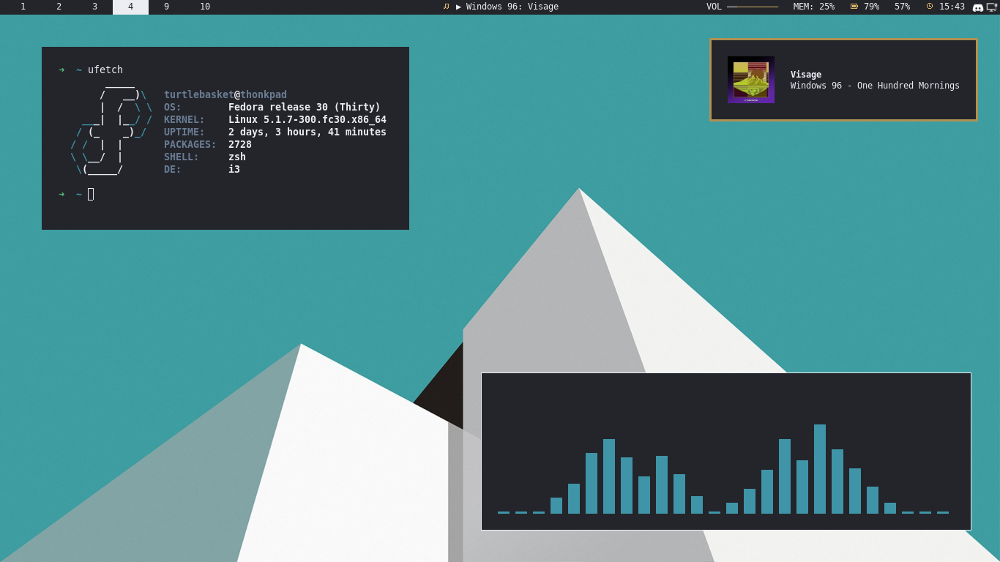
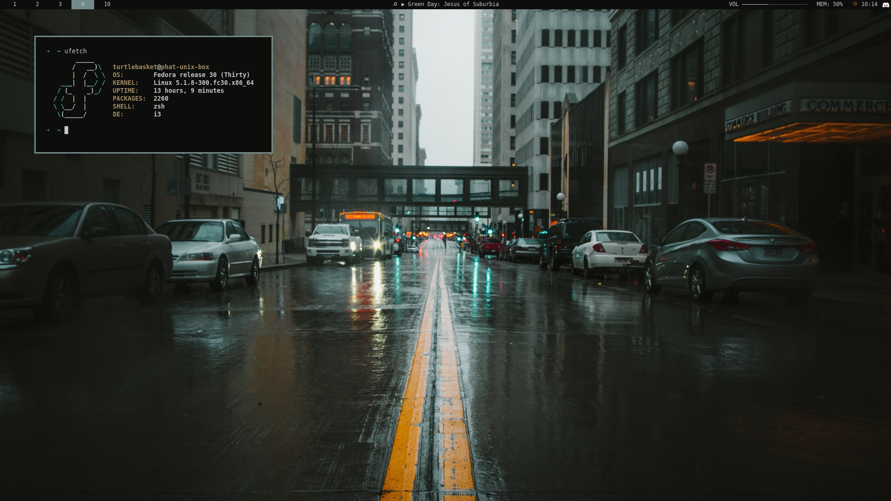
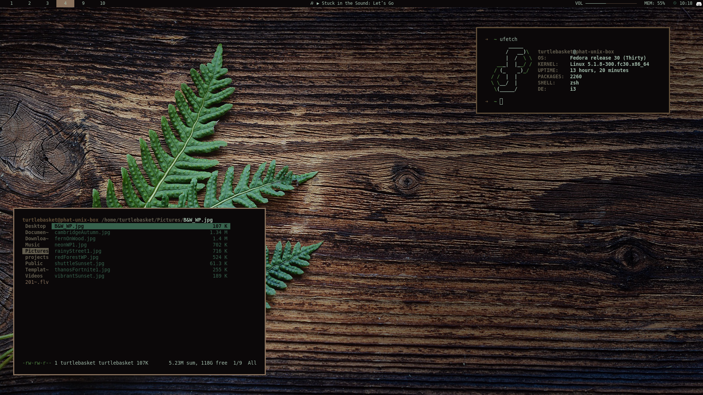
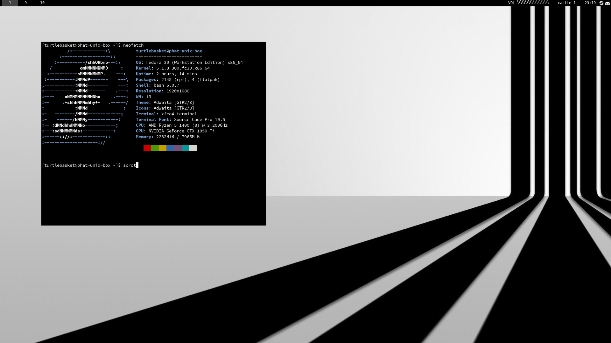
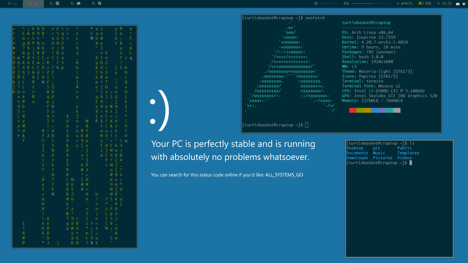

my-env
======
This is a repository for my personal tilng dev environments that I'd like to keep and possibly use again across machines. Feel free to take a look at and/or use anything from here!  

Flexible
--------
  

Supports dynamic theming via wal/wpg, too!  

Bare Bones
-----------

Simple Solarized
----------------

